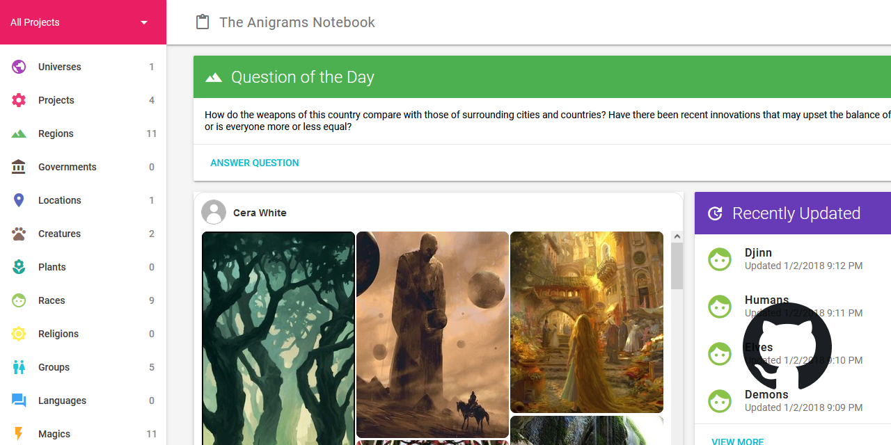

# The Anigrams Notebook

This repository contains the source code for the following website:

[The Anigrams Notebook](https://notebook.anigrams.org)

Technologies used:
* [ASP.NET MVC](https://dotnet.microsoft.com/apps/aspnet/mvc)
* [Entity Framework](https://docs.microsoft.com/en-us/ef/)
* [Microsoft SQL Server](https://www.microsoft.com/en-us/sql-server)

## Purpose
The Anigrams Notebook is a personalized worldbuilding website designed to allow me to keep track of notes, images, and inspiration for my games in a way that I can access from any computer in the house. It's based on [Notbook.ai](https://www.notebook.ai/).

